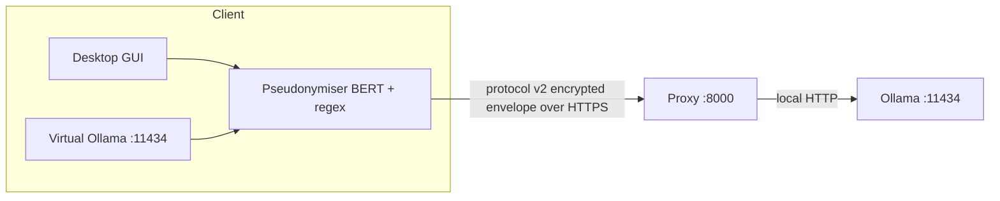

# Pukara

<p align="center">
  
</p>

[](https://github.com/ramsestein/pukara/actions/workflows/ci.yml)
[]()
[](LICENSE)
[]()

A privacy-first, self-hosted gateway for local large language models
([Ollama](https://ollama.com)). Pukara runs a Dockerized Ollama server behind an
application-layer encrypted proxy, and ships a desktop client that
**pseudonymises sensitive entities on-device** (BERT + regex) before anything
leaves the machine.

The name *Pukara* (Quechua for "fortress") plays on Ollama's alpaca: a small,
resilient stronghold around your model.

## Software metadata

| Field | Value |
|---|---|
| Name | Pukara |
| Version | 0.2.0 |
| License | [MIT](LICENSE) |
| Language | Python 3.9+ |
| Dependencies | `cryptography`, `numpy` (core); `torch`, `transformers`, `huggingface_hub` (client) |
| Repository | https://github.com/ramsestein/pukara |
| CI | [GitHub Actions](.github/workflows/ci.yml) |
| DOI | Pending (Zenodo release `v0.2.0`) |

## Abstract

Pukara addresses the gap between self-hosted LLMs and privacy. It encrypts the
whole client–server channel with protocol v2 (pre-shared key, AES-256-GCM with
HKDF-SHA256, direction-separated keys, server-clock freshness and anti-replay),
and **pseudonymises personal data on the client** before transmission:
detected entities are replaced by reversible placeholders and the
placeholder→text map never leaves the client. The sender's data remain personal
to the client; whether the transmitted text is anonymous for the recipient
depends on residual re-identification risk (see the threat model and
`docs/metrics.md`). It is designed for **Spanish** clinical text and is
model-agnostic (swap `BERT_MODEL` for another language).

## Motivation and significance

- Local models are increasingly self-hosted, but the transport and the payload
  are rarely protected end-to-end.
- Clinical and personal Spanish text has few ready-to-use pseudonymisation tools.
- Pukara packages encryption + on-device NER pseudonymisation + a turnkey
  Ollama-compatible endpoint, so existing tools (VS Code, Codex, Claude Code)
  work without changes.

## Software architecture



Protocol v2 (`src/secure.py`, see `docs/dev/adr-001-protocol.md`):

- `ENCRYPTION_SECRET` is a 32-byte pre-shared key (generate with
  `python -m src.keygen`).
- Direction-separated keys: `HKDF-SHA256(secret, "pukara/v2/c2s")` and
  `HKDF-SHA256(secret, "pukara/v2/s2c")`.
- Every envelope carries `{v, ts, req_id, nonce, ciphertext}`; the AAD binds
  version, direction, timestamp and request id.
- The server rejects timestamps outside `MAX_SKEW`, replays via a bounded
  fail-closed `req_id` cache, and responses are bound to the request id.
- Credentials and the deployment configuration (`user`, `password`, `model`,
  `bert_model`) travel inside the encrypted payload and must all match the
  server, or the request is rejected.

See [`docs/installation.md`](docs/installation.md) and
[`docs/client.md`](docs/client.md) for the full details.

## Functionality

- Dockerized Ollama server behind an encrypted proxy (protocol v2, IP allowlist,
  route allowlist, rate limiting, anti-replay, body limit).
- On-device pseudonymisation (BERT `bsc-bio-ehr-es-carmen-anon` + regex).
- Desktop GUI with auto-detected IP and start/stop of the local endpoint.
- Ollama/OpenAI-compatible local endpoint for external tools.

## Installation

Installation (server and client) is documented in
[`docs/installation.md`](docs/installation.md).

## Usage

- Desktop client and CLI: [`docs/client.md`](docs/client.md).
- VS Code, Codex CLI and Claude Code: [`docs/integrations.md`](docs/integrations.md).

## Security

See [`docs/threat-model.md`](docs/threat-model.md) for the threat model and
[`docs/SECURITY.md`](docs/SECURITY.md) for the security model, hardening and how to
report vulnerabilities.

## Evaluation

Pseudonymisation metrics are regenerated from versioned JSON files with
`make eval` and reported in [`docs/metrics.md`](docs/metrics.md). The reported
split is **MEDDOCAN `test`** (250 documents, out-of-distribution, run once).
The table compares Pukara with two **Presidio standalone baselines** using the
same evaluator (full numbers and the per-class table are in `docs/metrics.md`):

| Metric (MEDDOCAN test) | Pukara | Presidio (OOTB) | Presidio (ES) |
|---|---|---|---|
| Word F1 | 84.4 % | 59.1 % | 59.6 % |
| Span relaxed F1 | 83.6 % | 59.1 % | 57.2 % |
| PHI neutralization | 88.6 % | 56.2 % | 62.3 % |
| Leakage direct | 7.2 % | 100.0 % | 99.2 % |
| Leakage wide | 11.2 % | 100.0 % | 99.2 % |
| Over-redaction (non-PHI tokens altered) | 1.8 % | 2.9 % | 4.9 % |

Over-redaction is the domain-agnostic metric that measures how much non-PHI
text the detector rewrites; see `docs/metrics.md` for its bootstrap CI and the
per-component breakdown. CARMEN-I is kept only as a secondary in-distribution
upper bound (the model was fine-tuned on it).

## Limitations

- **No forward secrecy.** The protocol uses a pre-shared key: whoever obtains
  `ENCRYPTION_SECRET` can decrypt recorded traffic.
- **Detector recall is < 1.** Missed direct identifiers are transmitted in the
  clear; measured document-level leakage on MEDDOCAN test is 7.2 % (direct,
  CI 4.4–10.4 %) / 11.2 % (wide, CI 7.2–15.2 %) — see `docs/metrics.md`.
- **Residual leakage** is a document-level mean with a bootstrap CI; the point
  estimate alone understates the per-document variance (see the CI in
  `docs/metrics.md`).
- **Over-redaction.** The detector rewrites 1.8 % of non-PHI tokens on test
  (CI 1.8–2.0 %), mostly BERT fragments and `name` rules firing on title-case
  clinical headers — see `docs/dev/eval-diagnosis.md`.
- **Restoration policy.** Round-trip is exact (57/57). Restoration of an
  LLM-edited placeholder requires both brackets (`strict`); single/lost
  brackets are not recovered and are reported as honest failures.
  Placeholder-free text is never altered (0 %, even on adversarial tag-like
  tokens). See `docs/client.md`.
- **Domain-concept retention is not measured by design.** Pukara is not
  clinical-domain-specific, so a clinical-concept retention metric would bias
  the evaluation to that domain; the domain-agnostic over-redaction metric is
  used instead.
- **Out-of-distribution drop.** The BERT model is fine-tuned on CARMEN-I; on
  MEDDOCAN (a different clinical corpus) the neutralization is 88.6 %, lower
  than the in-distribution CARMEN-I figure in `docs/metrics.md`.
- **Corpus mismatch.** MEDDOCAN consists of structured clinical cases with a
  header block; results may not transfer to discharge letters or user prompts.
- **Traffic analysis is not mitigated** (sizes and timings are visible).
- **Re-identification via quasi-identifiers** is possible even when every direct
  identifier is replaced.
- **Streaming is not implemented** (see `docs/client.md`): the local endpoint
  forces `stream=false`.
- **A compromised client is out of scope** (it holds the original text, the map
  and the key).

## Tests

```bash
pip install -r requirements-dev.txt
python -m pytest -q
```

Tests cover `secure.py`, `proxy.py`, `anonymizer.py` and `local_ollama.py`
without downloading the BERT model, plus proxy↔client integration against a
fake Ollama. CI enforces ≥85% coverage on `secure.py` and `proxy.py`, `ruff`,
and `pip-audit`.

## Citation

If you use Pukara, please cite it using [`CITATION.cff`](CITATION.cff).

## License

MIT. See [`LICENSE`](LICENSE).

